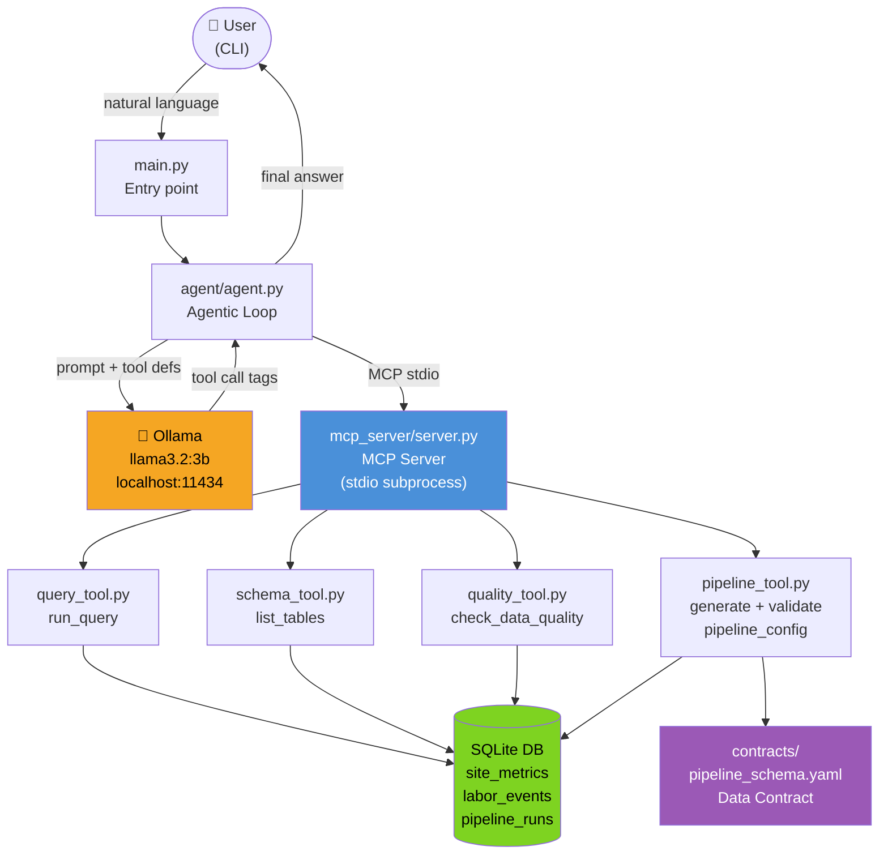
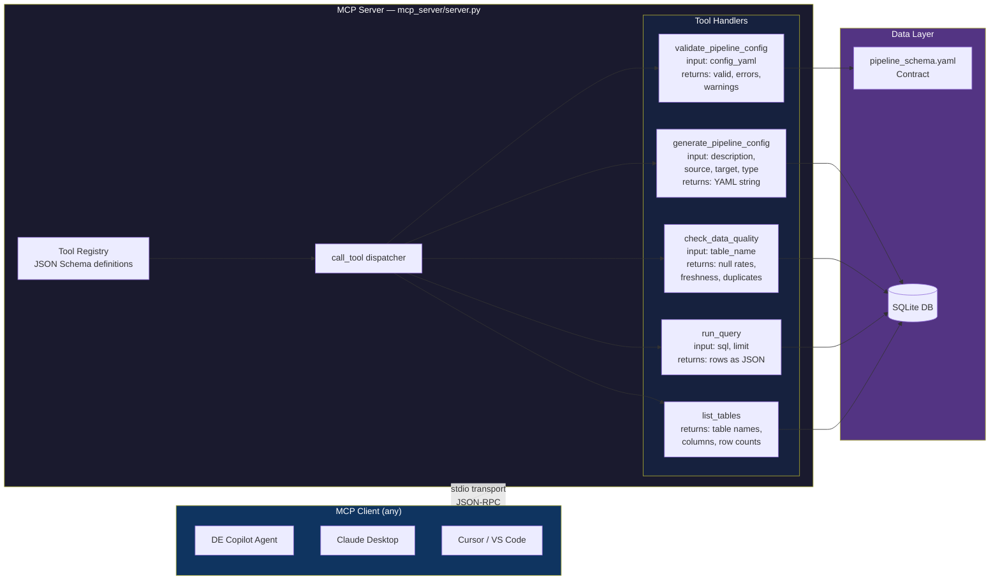
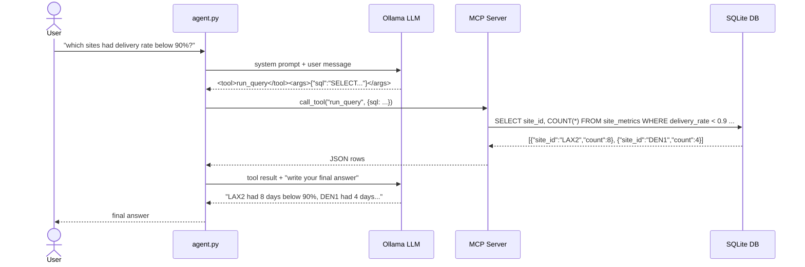
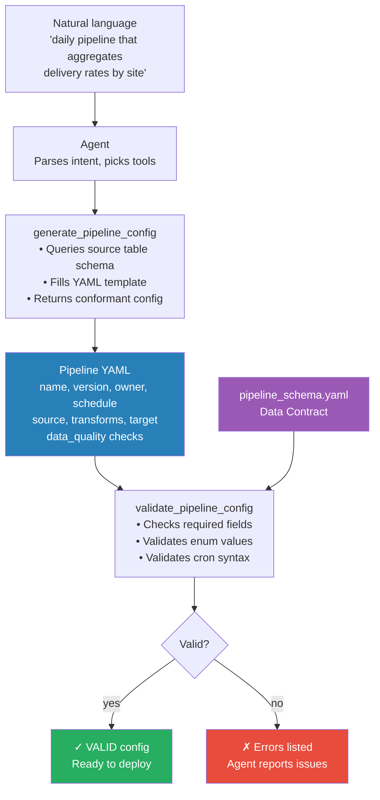

# DE Copilot — System Design Runbook

---

## Diagram 1 — Overall System Design



---

## Diagram 2 — MCP Server Design



---

## Diagram 3 — ReAct Agentic Loop



---

## Diagram 4 — Pipeline Generation Flow



---

## File Structure

```
de-copilot/
├── main.py                          ← CLI entry point
├── agent/
│   ├── agent.py                     ← Agentic loop (ReAct pattern)
│   └── prompts.py                   ← System prompt with tool definitions
├── mcp_server/
│   ├── server.py                    ← MCP server (exposes tools over stdio)
│   ├── database.py                  ← SQLite init + seed data
│   └── tools/
│       ├── query_tool.py            ← run_query handler
│       ├── schema_tool.py           ← list_tables handler
│       ├── quality_tool.py          ← check_data_quality handler
│       └── pipeline_tool.py        ← generate + validate pipeline handlers
├── contracts/
│   └── pipeline_schema.yaml         ← Data contract (what a valid pipeline looks like)
├── config/
│   └── example_pipeline.yaml        ← Working example config
└── data/
    ├── seed.sql                     ← Table CREATE statements
    └── de_copilot.db                ← SQLite DB (auto-created, mimics Redshift)
```

---

## Overall System Design

```
User (natural language CLI)
        ↓  python main.py "question"
Agent Loop  [agent/agent.py]
  - LLM: Ollama llama3.2:3b, running locally
  - Pattern: ReAct — reason → act → observe → repeat
  - Parses <tool>name</tool><args>{...}</args> from LLM output
        ↓  MCP stdio transport
MCP Server  [mcp_server/server.py]
  - Runs as a subprocess
  - Exposes 5 DE tools with JSON Schema definitions
  - Any MCP client (Claude, Cursor, VS Code) can connect to it
        ↓  SQL / Python logic
Tools  [mcp_server/tools/]
  - Execute against SQLite (same query patterns as Redshift)
  - Return structured JSON results
        ↓
SQLite DB  [data/de_copilot.db]
  - site_metrics: 300 rows (10 sites × 30 days), delivery rates, package counts
  - labor_events: 300 rows, headcount vs planned — ~5% intentional nulls for DQ demo
  - pipeline_runs: 50 rows, mix of SUCCESS/FAILED/RUNNING
```

---

## The 5 MCP Tools

| Tool | What it does | Demo value |
|---|---|---|
| `list_tables` | All tables with column names + row counts | Agent knows the schema before writing SQL |
| `run_query(sql, limit)` | Executes SELECT, returns rows as JSON | Real numbers, no hallucination |
| `check_data_quality(table_name)` | Null rates, row count, freshness, duplicate PKs | Automated DQ monitoring |
| `generate_pipeline_config(description, source_table, target_table, transform_type)` | Produces YAML config from structured params | NL → config |
| `validate_pipeline_config(config_yaml)` | Checks YAML against the data contract | Programmatic standard enforcement |

---

## What MCP Is

**One-liner:** A standard protocol for AI models to call external tools — like an API contract between the LLM and the outside world.

**How it works:**
1. Server declares tools: name + description + JSON Schema for inputs
2. Client (the agent) calls tools by name with args
3. Server executes and returns results
4. Transport: stdio locally, HTTP/SSE for remote

**Why UTR cares:** They want agents to orchestrate pipelines without custom code per system. MCP gives a standard interface so the agent can call any tool — run a query, deploy a config, trigger a job — without being tightly coupled to the implementation.

**Say this:**
> "MCP is the same protocol Claude, Cursor, and VS Code use to call external tools. I built a DE-focused MCP server that exposes query execution, schema inspection, and pipeline validation as tools. Any MCP client can call them — you could swap the local LLM for Claude or GPT and the tools work identically."

---

## The Agentic Loop (ReAct Pattern)

```
Step 1 — User asks: "which sites had delivery rate below 90% last week?"

Step 2 — Agent sends to LLM:
          [system prompt with tool definitions]
          [user message]

Step 3 — LLM outputs:
          <tool>run_query</tool><args>{"sql": "SELECT site_id, COUNT(*) FROM site_metrics
          WHERE delivery_rate < 0.9 AND metric_date >= date('now','-7 days')
          GROUP BY site_id", "limit": 100}</args>

Step 4 — Agent parses the tag → calls MCP server → tool executes SQL → returns JSON rows

Step 5 — Agent appends result to conversation context + instruction for next step

Step 6 — LLM outputs final answer in plain text (no tool tags) → agent returns to user
```

**Why ReAct and not OpenAI function-calling format:**
Small local models (3B params) are unreliable with structured JSON tool_calls. ReAct — model outputs tool calls as formatted text, agent parses them — works with any model that can follow instructions. In prod with a larger model you'd use native function calling.

---

## Data Contract Pattern

```
contracts/pipeline_schema.yaml     defines what a valid pipeline must contain
          ↓
validate_pipeline_config tool      enforces it — checks required fields, valid enums, cron syntax
          ↓
generate_pipeline_config tool      inspects source table schema, fills a conformant YAML template
          ↓
Agent orchestrates the flow        NL description → generate → validate → return to user
```

**What this mirrors at UTR:**
> "Instead of engineers writing custom Spark jobs per use case, they describe what they need and the framework generates a config that's validated against a contract. The agent is the bridge between natural language intent and the config-driven framework."

---

## The 3 Demo Commands

```bash
cd /Users/kanishk/Downloads/WorkingDir/de-copilot
source venv/bin/activate

python main.py "what tables do we have and which ones have data quality issues?"
# → list_tables + check_data_quality ×3
# → finds: labor_events 5.3% null headcount, pipeline_runs 24% null rows_processed

python main.py "which sites had delivery rate below 90% last week?"
# → run_query with date filter
# → finds: LAX2 (8 days below 90%), DEN1 (4 days)

python main.py "build me a pipeline that aggregates daily delivery rates by site"
# → generate_pipeline_config + validate_pipeline_config
# → returns full YAML + "✓ VALID — passes all 9 contract checks"
```

---

## Connecting to Your Background

| Your experience | Maps to this project |
|---|---|
| A2H ETL — 338M ASINs, PySpark + Redshift | Same source/target patterns in the pipeline config schema |
| EPR compliance pipelines | Data contracts + validation — exact same concept |
| F1 visa tracker — Ollama LLM + autonomous action | Same ReAct loop, same local Ollama setup |
| Kafka ingestion | `kinesis` source type supported in the contract schema |

**The framing:**
> "I've already built this perceive → reason → act pattern in my F1 tracker — a local LLM classifying signals and taking autonomous action. The architecture here is identical. The difference is the tools are DE operations instead of notification APIs, and the agent helps engineers instead of monitoring visa slots."
